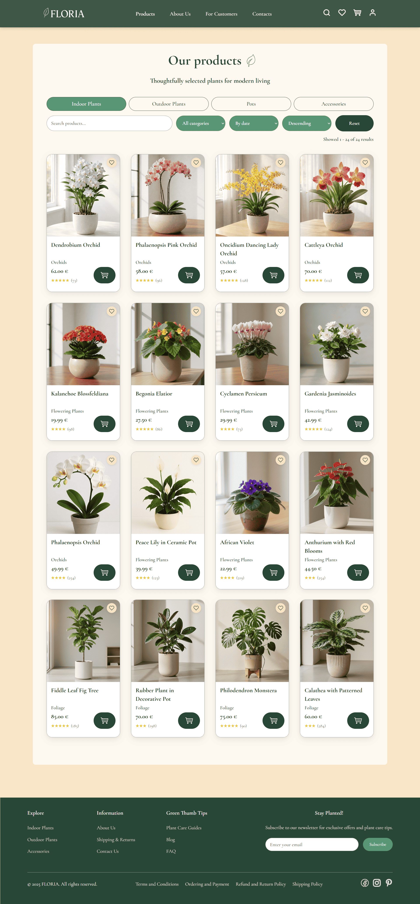
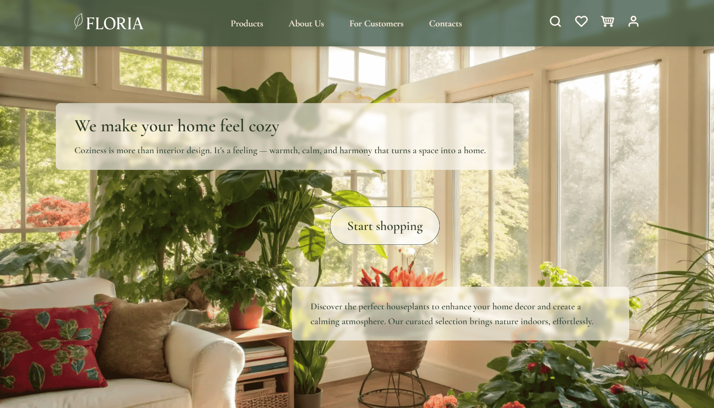
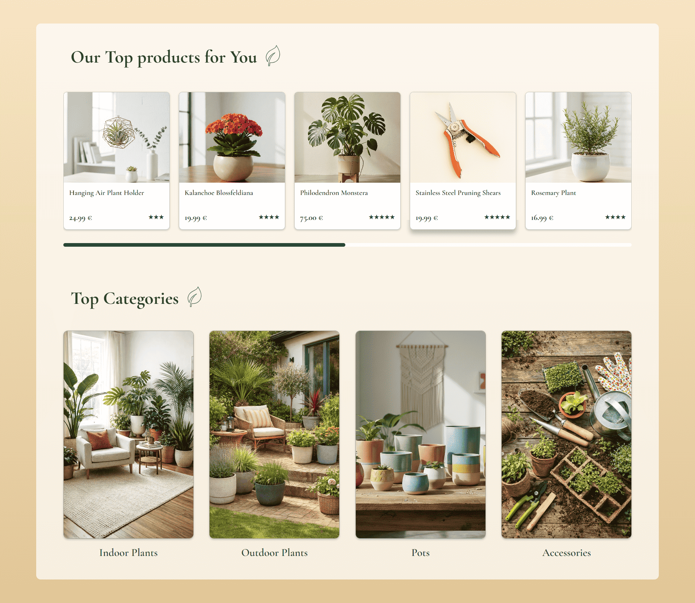
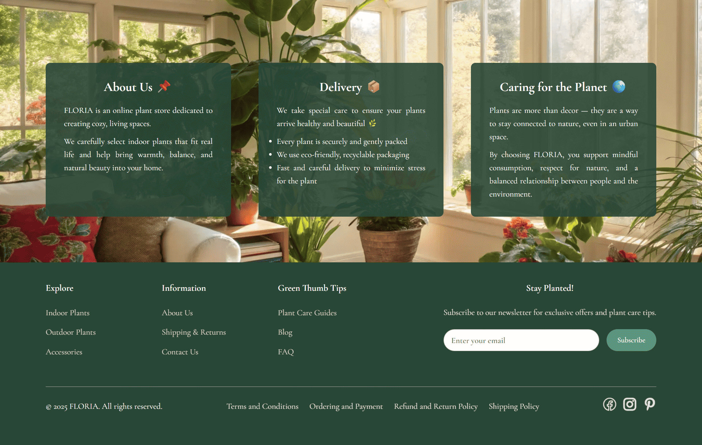
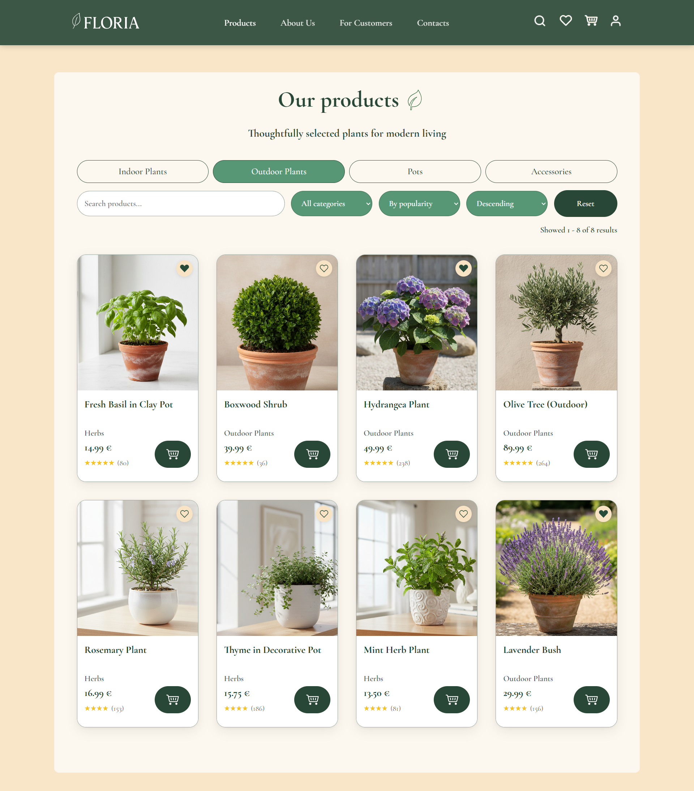
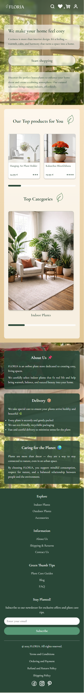
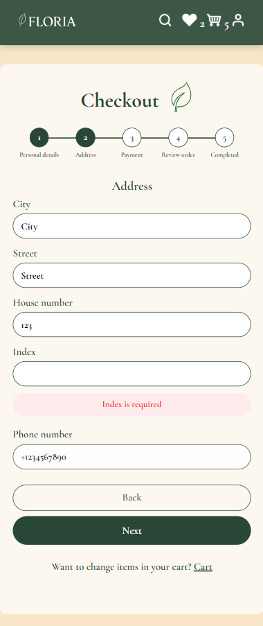

# Online Store – FLORIA


FLORIA is a full-stack e-commerce single-page application built with React, TypeScript, Node.js and PostgreSQL, simulating a realistic online retail environment.

The project focuses on production-oriented frontend architecture, structured state management, secure authentication flows and realistic business logic implementation.

🎥 **Video Walkthrough:** _(add link here)_

---

## Preview

<p align="center" verticalAlign="top">
  
  
  
</p>

## User Journey

This section illustrates a typical user flow through the application — from browsing products to completing an order.

### 1️⃣ Landing & Product Discovery

Users land on the homepage, explore curated products and navigate to the catalog.

<details>
<summary>View screenshots</summary>

The homepage is divided into distinct visual sections to guide user attention and preserve hierarchy.

**Home – Hero Section**


**Home – Products & Categories**


**Home – Information Blocks & Footer**


</details>

### 2️⃣ Browsing & Filtering Products

Users can filter products by category, sort by different criteria and search in real time.

<details>
<summary>View screenshots</summary>

**Products – Default View**


**Products – Filtered by "Outdoor Plants"**


</details>

### 3️⃣ Authentication (required for cart & favourites)

Users can register or log in to manage their cart, favourites and orders.

<details>
<summary>View screenshot</summary>

**Login**


</details>

### 4️⃣ Shopping Cart Management

Users can adjust quantities, remove items and see live total calculations.

<details>
<summary>View screenshot</summary>

**Cart**


</details>

### 5️⃣ Checkout Flow (Multi-step Form)

A structured 5-step checkout process with form validation ensures clear user progression and controlled data entry.

<details>
<summary>View screenshots</summary>

**Checkout Flow**

<p align="center">
  
  
</p>

</details>

### 6️⃣ Personalised Experience – Favourites

Authenticated users can manage saved items separately from the shopping cart.  
This demonstrates user-specific state handling and protected routes.

<details>
<summary>View screenshot</summary>


</details>

This journey demonstrates how the application handles product discovery, state management, user authentication and transactional flows within a cohesive and consistent UI system.

---

## Responsive Design

<details>
<summary>View screenshots</summary>

<div style="display: flex; gap: 24px; align-items: flex-start;">
  <div style="flex: 1;">
    
  </div>

  <div style="flex: 1; display: flex; flex-direction: column; gap: 40px;">
    
    
    
  </div>
</div>

</details>

## Project Overview

FLORIA simulates a realistic online store environment and demonstrates:

✔ Scalable React architecture  
✔ Predictable state management using Redux Toolkit  
✔ REST API integration  
✔ JWT-based authentication  
✔ Secure password handling with bcrypt  
✔ Multi-step checkout logic  
✔ Responsive layout across multiple breakpoints

---

## Architecture Highlights

- Clear separation between frontend and backend
- Redux slices structured by domain responsibility
- Form validation using Formik + Yup
- Protected routes with token-based session handling
- Modular SCSS architecture
- RESTful backend with PostgreSQL relational schema

---

## Key Functional Areas

### Product & Catalog

- Product listing with filtering and sorting
- Category-based navigation
- Real-time search with user feedback

### Shopping Experience

- Cart management with quantity updates
- Favourites system
- Multi-step checkout (data → address → payment → review)

### Authentication

- Registration and login with validation
- JWT session handling
- Protected routes

### Informational Pages

- About
- Contacts
- Plant Care
- Customer information (shipping, returns, payments)

---

## Setup

<details>
<summary>Click to expand deployment steps</summary>

### Deployment on Render

<details>
<summary><b>Manual Setup</b></summary>

1. PostgreSQL Database:
   - Create new PostgreSQL database on Render
   - Go to database **Shell** tab
   - Run entire `backend/config/database.sql` script

2. Backend Web Service:
   - Runtime: Node
   - Build: `cd backend && yarn install && yarn build`
   - Start: `cd backend && yarn dev`
   - Environment variables:
     - `DATABASE_URL` (copy from database connection string)
     - `JWT_SECRET` (generate random string)
     - `PORT=5000`
     - `NODE_ENV=production`

3. Frontend Static Site:
   - Build: `cd frontend && yarn install && yarn build`
   - Publish: `frontend/build`
   - Environment variables:
     - `REACT_APP_API_URL` (backend URL + /api, e.g. `https://floria-backend.onrender.com/api`)

</details>

<details>
<summary><b>Local Development Setup</b></summary>

#### Prerequisites

- Node.js 18+
- Yarn
- PostgreSQL 15+

#### Setup Instructions

1. Clone the repository:

```bash
git clone <repository-url>
cd Online-store
```

2. Create environment file:

```bash
cp .env.example .env
```

3. Edit `.env` file and configure your database credentials and JWT secret

4. Setup and run the backend:

```bash
cd backend
yarn install
yarn dev
```

5. Setup and run the frontend (in a new terminal):

```bash
cd frontend
yarn install
yarn start
```

6. Initialize the database:

```bash
psql -U postgres -d online_store -f backend/config/database.sql
```

7. Access the application:

- Frontend: http://localhost:3000
- Backend API: http://localhost:5000

</details>
</details>

## What This Project Demonstrates

### Frontend

- Building scalable React applications with TypeScript
- Designing reusable UI components
- Managing global state with Redux Toolkit
- Implementing multi-step forms with validation
- Handling async data flows and loading states
- Responsive layout design with SCSS Modules

### Backend

- Designing relational database schemas in PostgreSQL
- Implementing REST APIs with Express
- Managing authentication with JWT
- Ensuring secure password handling with bcrypt
- Maintaining data consistency between client and server

### Engineering Practices

- Clear separation of concerns
- Incremental feature development
- Refactoring for maintainability
- Debugging asynchronous UI issues
- Applying documentation-driven development

---

## Responsive Design

The application is fully responsive and optimized for modern devices.

### Breakpoints

- **Mobile**: ≥ 412px
- **Tablet**: ≥ 768px
- **Desktop**: ≥ 1024px
- **Wide screens**: ≥ 1440px

### Adaptive Features

- Flexible grid layouts (1–5 columns)
- Touch-friendly controls
- Adaptive typography and spacing
- Collapsible filters on small screens
- Responsive navigation optimized for mobile devices

Minimum supported screen width: **412px**

---

## Tech Stack

### Frontend

- React 18
- TypeScript
- Redux Toolkit
- React Router
- Formik
- Yup
- SCSS Modules

### Backend

- Node.js
- Express
- TypeScript
- PostgreSQL

### Authentication & Security

- JWT
- bcrypt

### API & Communication

- REST API
- Axios

### Deployment

- Render

---

## Future Improvements

- Automated test coverage (frontend & backend)
- Performance optimization
- Improved error handling and logging
- Docker-based containerization
- CI/CD integration

## Disclaimer

This project was created for **educational and portfolio purposes only**.  
No real payments are processed.  
All images and third-party assets are used for demonstration purposes.  
All rights belong to their respective owners.
