# Online Store – FLORIA


FLORIA is a full-stack e-commerce SPA built with React, TypeScript, Node.js and PostgreSQL.

The project simulates a realistic online retail environment and focuses on scalable frontend architecture, structured state management, secure authentication and transactional flows.


## Table of Contents

- [Online Store – FLORIA](#online-store--floria)
  - [Table of Contents](#table-of-contents)
  - [Preview](#preview)
  - [User Flow](#user-flow)
  - [Responsive Design](#responsive-design)
  - [Project Overview](#project-overview)
  - [Key Functional Areas](#key-functional-areas)
  - [Setup](#setup)
  - [Architecture \& Tech Stack](#architecture--tech-stack)
      - [Frontend](#frontend)
      - [Backend](#backend)
  - [Future Improvements](#future-improvements)
  - [Disclaimer](#disclaimer)

🎥 **Video Walkthrough:** _(add link here)_

---

## Preview

<p align="center" verticalAlign="top">
  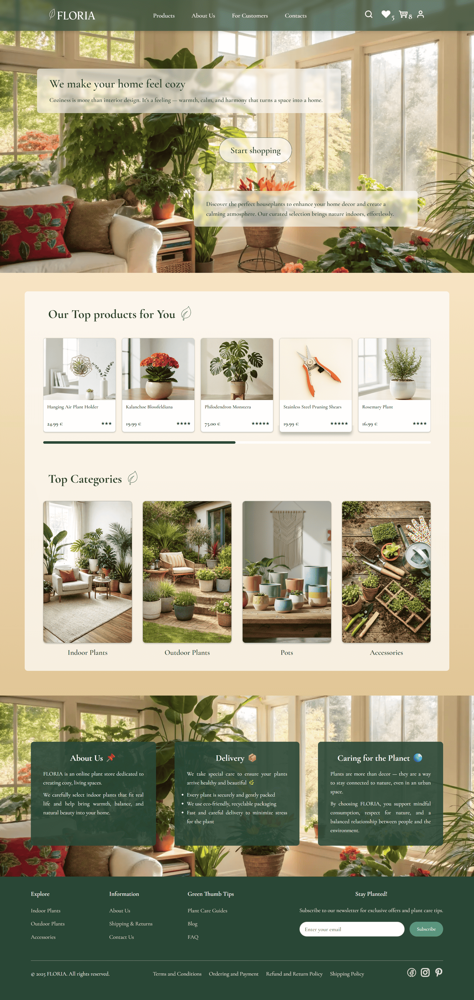
  
  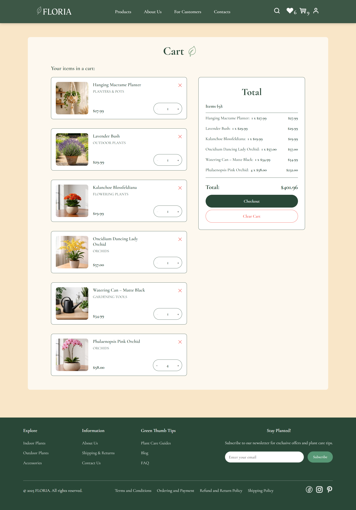
</p>

## User Flow

FLORIA simulates a complete e-commerce journey:

- Product discovery and filtering  
- Authentication and protected routes  
- Cart management with live calculations  
- Multi-step checkout with validation  
- Personalised favourites  

<details>
<summary><strong>🔎 Explore User Flow Screenshots</strong></summary>

**Home**


**Products**
<p align="center">
  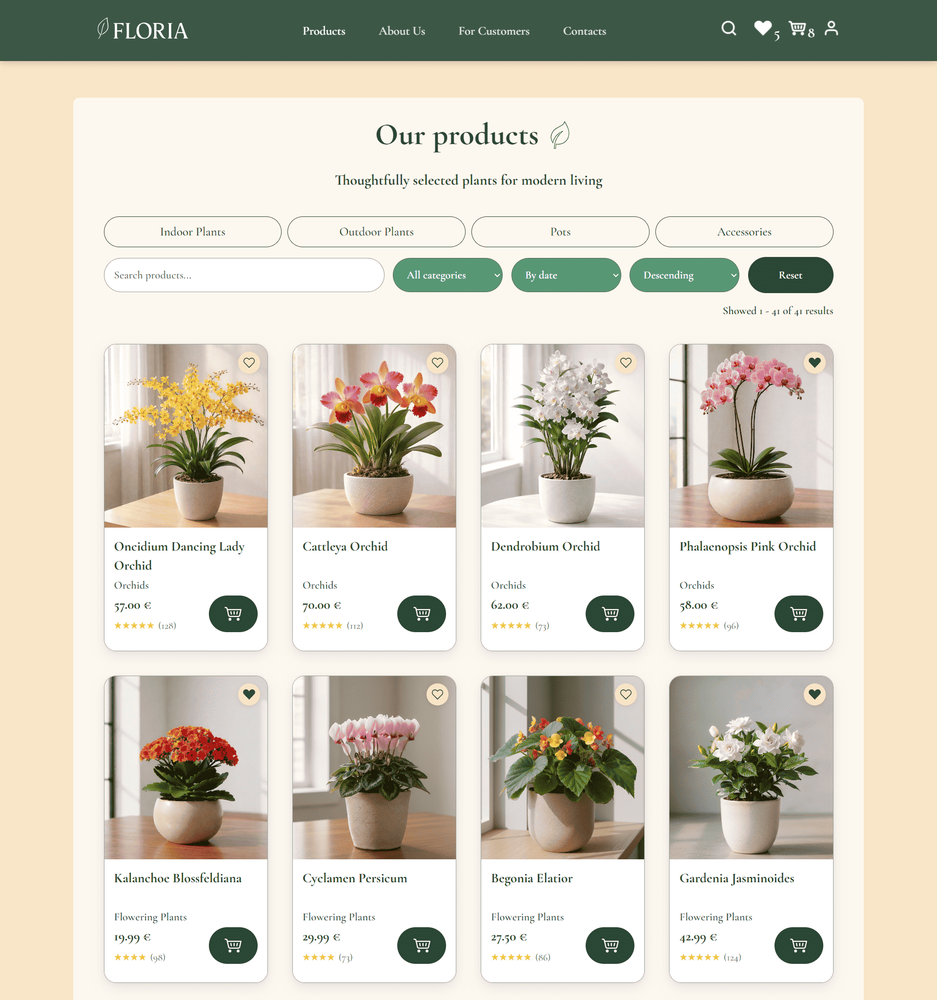
  
</p>

**Product Detail Page**
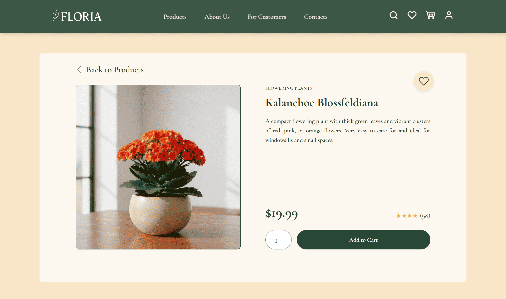

**Checkout Flow**
<p align="center">
  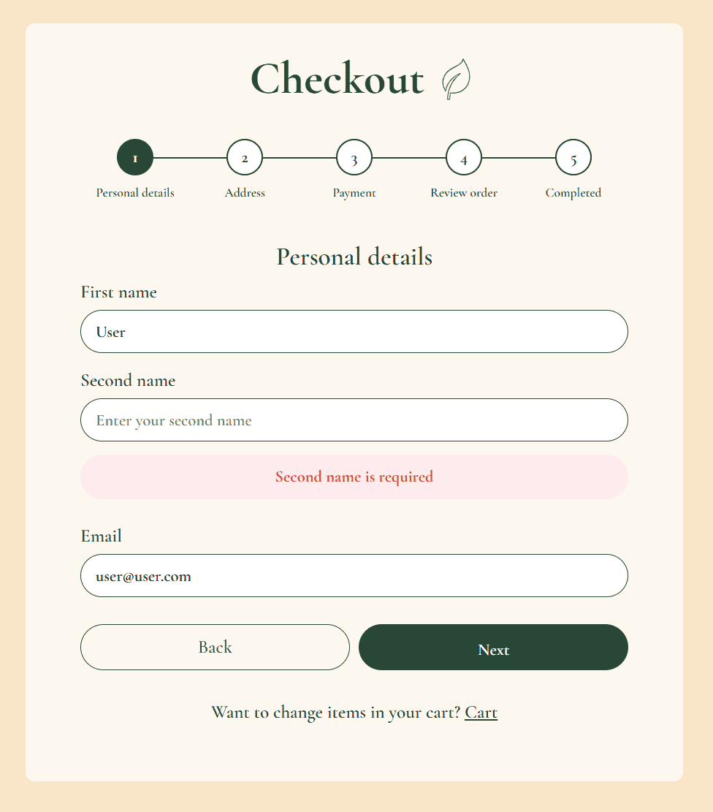
  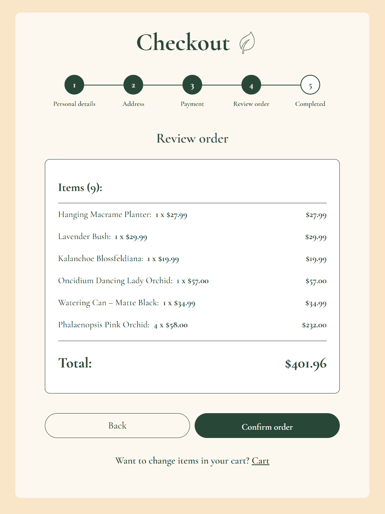
</p>

**Login**
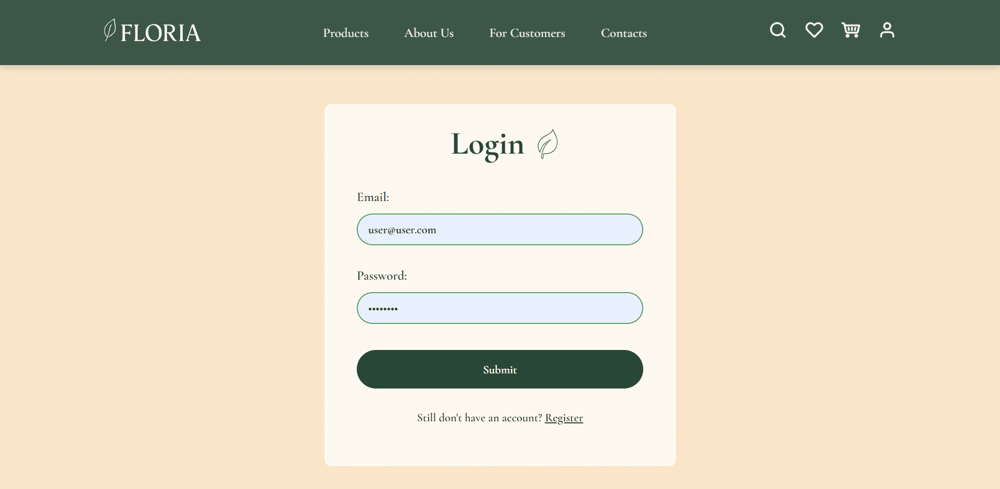

**Cart**
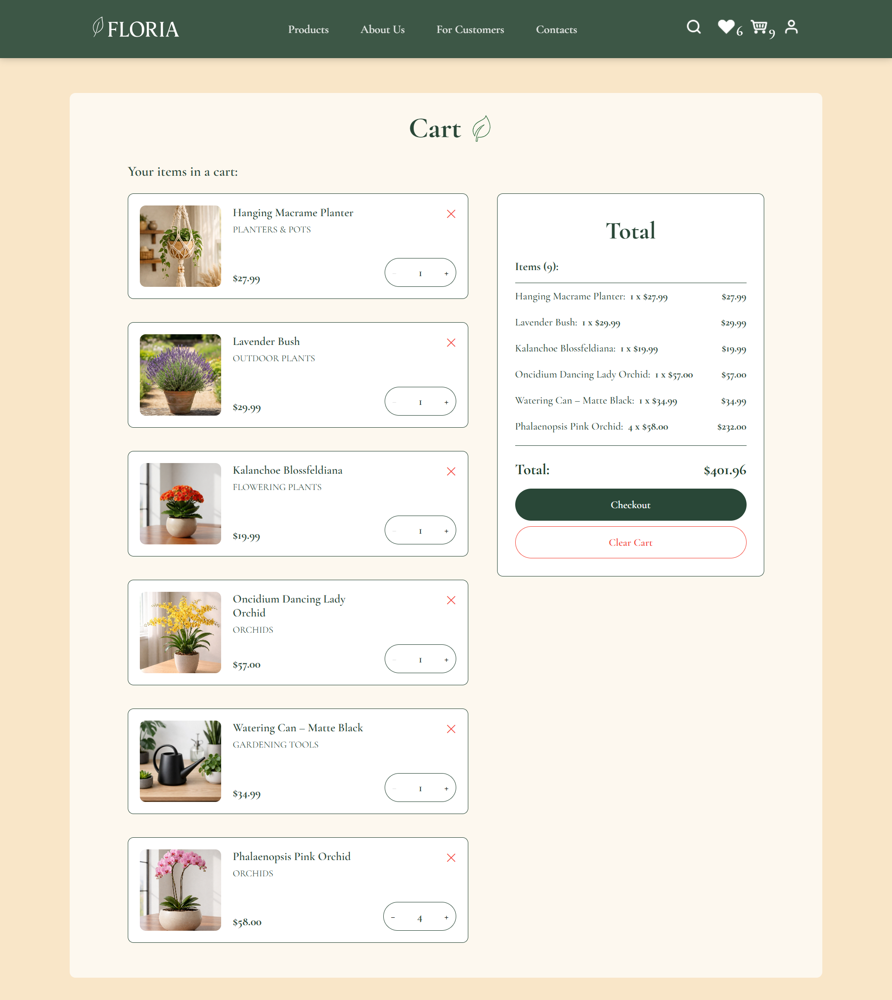

**Favourites**
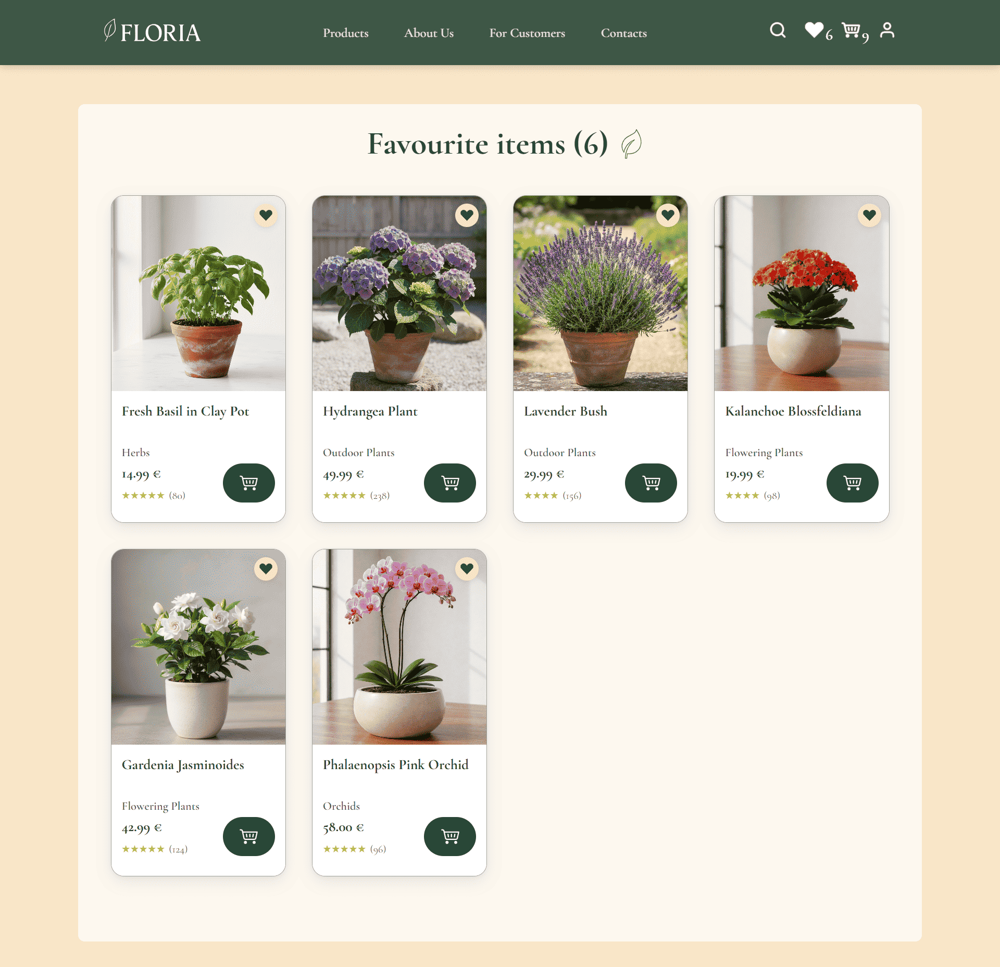

</details>

---

## Responsive Design

Fully responsive across:

- **Mobile**: ≥ 412px
- **Tablet**: ≥ 768px
- **Desktop**: ≥ 1024px
- **Wide screens**: ≥ 1440px
<details>

<summary><strong>🔎 View Mobile Layout</strong></summary>

<table align="center" width="100%">
  <tr>
    <td width="35%" valign="top">
      
    </td>
    <td width="35%" valign="top">
      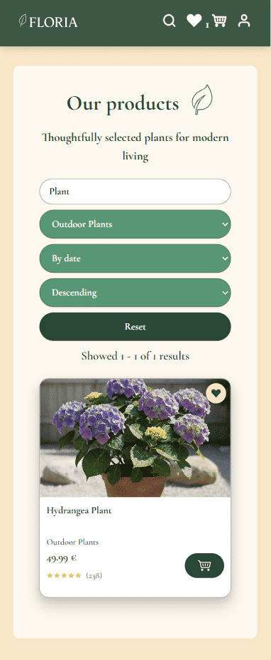<br /><br />
      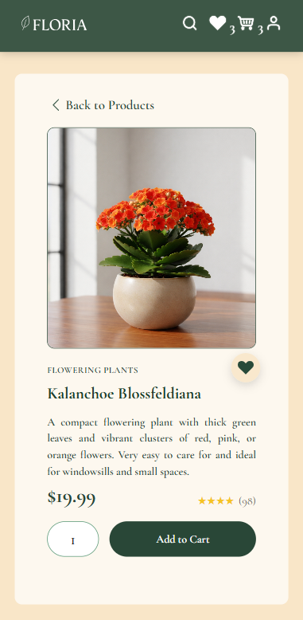<br /><br />
      
    </td>
  </tr>
</table>

</details>

## Project Overview

FLORIA highlights the following technical aspects:

✔ Clear separation between frontend and backend  
✔ Scalable React architecture with modular SCSS  
✔ Domain-based state management using Redux Toolkit  
✔ Form validation with Formik + Yup  
✔ REST API integration with PostgreSQL relational schema  
✔ JWT-based authentication and protected routes  
✔ Secure password handling with bcrypt  
✔ Multi-step checkout logic  
✔ Responsive layout across multiple breakpoints

---

## Key Functional Areas

- Product catalog with filtering, sorting and real-time search  
- Cart & favourites with persistent user state  
- Multi-step checkout with validation (Formik + Yup)  
- JWT-based authentication & protected routes  
- REST API integration with PostgreSQL  
- Fully responsive layout (mobile → wide screens)

---

## Setup

<details>
<summary><b>Deployment on Render</b></summary>

The project is configured as a monorepo with a Blueprint file (`render.yaml`), so backend + frontend + PostgreSQL are created in a single deployment.

1. Push the repository with `render.yaml` to GitHub.
2. In Render, choose **New + → Blueprint** and select the repository.
3. Render will automatically create:
  - PostgreSQL: `floria-db`
  - Web Service (Node): `floria-backend`
  - Static Site: `floria-frontend`
4. After the first deployment, open the database (`floria-db`) → **Shell** and run the SQL from `apps/backend/config/database.sql`.
5. If the backend service name was changed, update `REACT_APP_API_URL` for the frontend.

</details>

<details>
<summary><b>Local Development Setup</b></summary>

```bash
git clone <repository-url>
cd Online-store
yarn install

# backend (terminal 1)
yarn dev:backend

# frontend (terminal 2)
yarn dev:frontend

psql -U postgres -d online_store -f apps/backend/config/database.sql
```

7. Access the application:

- Frontend: http://localhost:3000
- Backend API: http://localhost:5000

</details>
</details>

## Architecture & Tech Stack

#### Frontend
React 18 · TypeScript · Redux Toolkit · React Router · Formik · Yup · SCSS Modules
  
- Component-based structure with reusable UI elements  
- Centralised state management using Redux Toolkit 
- Explicit loading and error state handling
- Multi-step form logic with validation  

#### Backend
Node.js · Express · PostgreSQL · TypeScript

- REST API design  
- Relational database schema  
- JWT authentication  
- Secure password hashing with bcrypt  

---

## Future Improvements

- Automated test coverage (frontend & backend)
- Performance optimization
- Improved error handling and logging
- Docker-based containerization
- CI/CD integration

## Disclaimer

This project was created for **educational and portfolio purposes only**.  
No real payments are processed.
